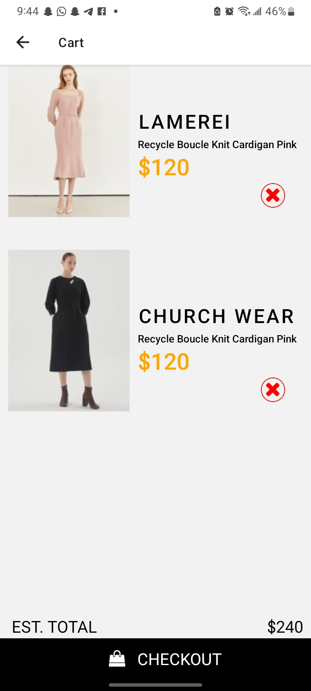

# rn-assignment6-11317254

### *Student ID:* 11317254

## Brief explanation of design choices and implementation of data storage

### **Design Choices:**
In the design of **CartScreen.js**, the focus is on effective state management and ensuring data persistence for a seamless user experience. **The use of `useState`** allows for dynamic state management of the cart items, while **`useEffect`** ensures that items previously added to the cart are fetched from `AsyncStorage` when the component mounts. This guarantees that the cart maintains its contents across app restarts. The **`removeFromCart`** function updates both the cart state and **`AsyncStorage`**, providing a smooth removal process and notifying the user upon successful removal. The screen layout features a prominent header, a conveniently placed search icon, and a clearly marked checkout header. Each cart item is displayed with its image, name, description, price, and a button for removal. **The footer** offers a summary of the total cost and a checkout button, facilitating a straightforward and intuitive checkout process for the user.

**HomeScreen.js** is designed with a focus on state management and navigation to enhance the shopping experience. The use of `useState` manages the visibility of the category list, while **`useNavigation`** facilitates seamless transitions between the home and cart screens. **The `addToCart`** function ensures items are added to the cart and stored in **`AsyncStorage`**, maintaining consistency in the cart’s contents. The screen’s design includes a comprehensive header featuring menu, search, and shopping cart icons. The category list can be toggled for visibility, enhancing the browsing experience. Sample items are displayed in a visually appealing grid-like layout, optimizing space usage and making the most of the screen real estate. Consistency in design elements across both screens ensures a cohesive user experience, while the use of interactive elements like `TouchableOpacity` enhances usability and engagement, making the app both functional and user-friendly. 

### **Implementation of Data Storage:**

#### CartScreen.js

In CartScreen.js, data storage is handled using `AsyncStorage` from the `@react-native-async-storage/async-storage` package, ensuring the persistence of cart items. The `useEffect` hook invokes the `fetchCart` function when the component mounts. This function retrieves the cart items from `AsyncStorage` asynchronously, parses the JSON data, and updates the state via `useState`. This process guarantees that the cart's contents are preserved across app restarts, providing a seamless and consistent user experience.

The `removeFromCart` function manages item removal from the cart. When an item is removed, the state is updated by filtering out the removed item, and the new state is then saved back to `AsyncStorage` in JSON format. This ensures that the cart state is always synchronized with the stored data, reflecting user actions immediately and maintaining persistence.

#### HomeScreen.js

In HomeScreen.js, `AsyncStorage` is similarly utilized to manage cart data, ensuring items added to the cart are persistently stored across sessions. The `addToCart` function retrieves the current cart contents from `AsyncStorage`, parses the data, adds the new item, and saves the updated cart back to `AsyncStorage` in JSON format.

This approach ensures that items added to the cart are immediately stored and available in future sessions. By leveraging `AsyncStorage`, the app maintains the cart's state across user sessions, providing a consistent and reliable experience. The use of asynchronous operations ensures smooth and responsive interactions, enhancing the overall performance and usability of the app.

## ScreenShots of the App

